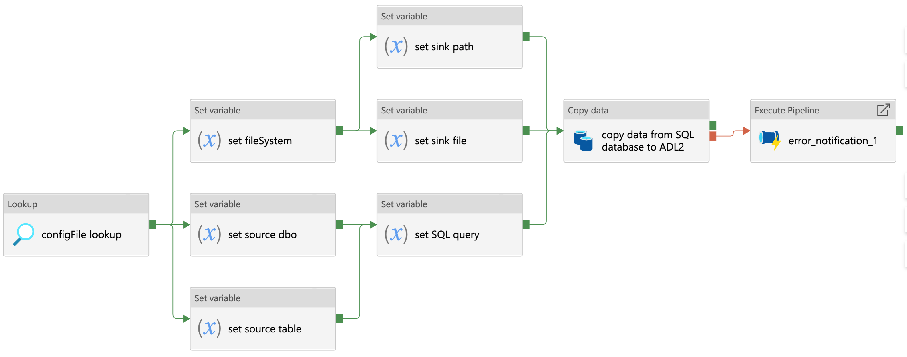

****************************
Azure Data Factory Templates 
****************************

Open access and reusable design documentation of pipelines used in the NHSX Analytics Unit Azure Data Factory (ADF) environment.

SQL Database Ingestion Pipeline
===============================

Metadata
--------

.. code:: python

    # -------------------------------------------------------------------------
    # Copyright (c) 2021 NHS England and NHS Improvement. All rights reserved.
    # Licensed under the MIT License. See license.txt in the project root for
    # license information.
    # -------------------------------------------------------------------------

    """
    FILE:           ingestion_sql.json
    DESCRIPTION:
                    Pipeline to ingest raw data to Azure Datalake blob storage
                    from a SQL database.

    CONTRIBUTORS:   Craig Shenton, Mattia Ficarelli
    CONTACT:        data@nhsx.nhs.uk
    CREATED:        20 Sept 2021
    VERSION:        0.0.1
    """

Description
-----------

*Figure 1: Data ingestion from a SQL database*

Pipeline to ingest raw data to Azure Datalake blob storage from a SQL database.

 1. Looks up the JSON configuration file for this pipeline
 2. Source:

    a. Sets the source database owner (dbo)
    b. Sets the source table
    c. Sets the SQL query

 3. Sink:

    a. Sets the file system
    b. Sets the sink path
    c. Sets the sink file

 4. Copy activity copies the data returned from the SQL query as either a .csv file or a .parquet file.
 5. If the copy activity fails, the error notification logic app API will notify the specified email address of the error

Pipeline Configuration
----------------------

.. code:: python

    {
      "pipeline": {
        "name": "ingestion_sql",
        "folder": "templates/ingestion/sql",
        "adl_file_system": "file_system",
        "raw": {
          "source_dbo": "dbo",
          "source_table": "table_1",
          "source_query": "SELECT * FROM dbo.table_1 ORDER BY Date DESC",
          "sink_path": "raw/path/to/data",
          "sink_file": "table_1.parquet"
        }
    }

Data Factory Configuration
--------------------------

Download the Azure Data Factory json configuration file to use this template in your own data pipelines.

:download:`sql-ingestion.json <https://raw.githubusercontent.com/nhsx/au-data-engineering/main/config-files/adf-templates/sql-ingestion.json>`

Databricks Processing Pipeline
===============================

Metadata
--------

.. code:: python

    # -------------------------------------------------------------------------
    # Copyright (c) 2021 NHS England and NHS Improvement. All rights reserved.
    # Licensed under the MIT License. See license.txt in the project root for
    # license information.
    # -------------------------------------------------------------------------

    """
    FILE:           processing_databricks.json
    DESCRIPTION:
                    Pipeline to process data from a folder in Azure Datalake 
                    blob storage using a databricks notebook.

    CONTRIBUTORS:   Craig Shenton, Mattia Ficarelli
    CONTACT:        data@nhsx.nhs.uk
    CREATED:        23 Sept 2021
    VERSION:        0.0.1
    """

Description
-----------

.. image:: _static/img/pipeline_temps/databricks/databricks.png
  :width: 600
  :alt: Data processing using a Databricks notebook
*Figure 1: Data processing using a Databricks notebook*

 1. Pipeline to process data from a folder in Azure Datalake blob storage using a databricks notebook
 2. Lookup the JSON configuration file for this pipeline
 3. Set the databricks notebook path.
 4. Databricks notebook activity runs the databricks notebook specified using an ephemeral job cluster
 5. If the databricks notebook activity fails, the error notification logic app API will notify the specified email address of the error.

Pipeline Configuration
----------------------

.. code:: python

    {
      "pipeline": {
        "name": "processing_databricks",
        "folder": "templates/processing/databricks",
        "project": {
          "databricks_notebook": "/path/to/databricks/notebook"
        }
    }

Databricks Orchestration
------------------------
.. note::
   Alternatively this pipeline can be used to trigger an orchestrator databricks notebook which in turn runs a series of data processing notebooks.

.. code:: python

    {
      "pipeline": {
        "name": "processing_databricks",
        "folder": "templates/processing/databricks_orchestrator",
        "project": {
          "databricks_orchestrator_notebook": "/path/to/databricks/orchestrator_notebook"
          "databricks":[    
              {
            "sink_path": "path/to/processed/data",
            "sink_file": "file_1.csv",
            "databricks_notebook": "/path/to/databricks/processing_notebook1"
            },    
              {
            "sink_path": "path/to/processed/data",
            "sink_file": "file_2.csv",
            "databricks_notebook": "/path/to/databricks/processing_notebook2"
            },
        }
    }

Python code to sequentially run databricks notebook paths specified in a JSON config file from a databricks orchestrator notebook.

.. code:: python

    #Squentially run datbricks notebooks
    for index, item in enumerate(config_JSON['pipeline']['project']['databricks']): 
        notebook = config_JSON['pipeline']['project']['databricks'][index]['databricks_notebook']
        dbutils.notebook.run(notebook, 120)
      except Exception as e:
        print(e)

Data Factory Configuration
--------------------------

Download the Azure Data Factory json configuration file to use this template in your own data pipelines.

:download:`processing_databricks.json <https://raw.githubusercontent.com/nhsx/au-data-engineering/main/config-files/adf-templates/databricks-processing.json>`

