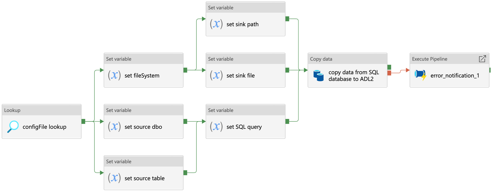
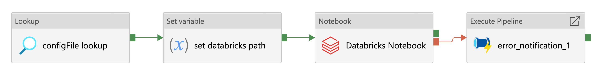

****************************
Azure Data Factory Templates 
****************************

Open access and reusable design documentation of pipelines used in the NHSX Analytics Unit Azure Data Factory (ADF) environment.

SQL Database Ingestion Pipeline
===============================

Metadata
--------

.. code:: python

    # -------------------------------------------------------------------------
    # Copyright (c) 2021 NHS England and NHS Improvement. All rights reserved.
    # Licensed under the MIT License. See license.txt in the project root for
    # license information.
    # -------------------------------------------------------------------------

    """
    FILE:           ingestion_sql.json
    DESCRIPTION:
                    Pipeline to ingest raw data to Azure Datalake blob storage
                    from a SQL database.

    CONTRIBUTORS:   Craig Shenton, Mattia Ficarelli
    CONTACT:        data@nhsx.nhs.uk
    CREATED:        20 Sept 2021
    VERSION:        0.0.1
    """

Description
-----------

*Figure 1: Data ingestion from a SQL database*

Pipeline to ingest raw data to Azure Datalake blob storage from a SQL database.

 1. Looks up the JSON configuration file for this pipeline
 2. Source:

    a. Sets the source database owner (dbo)
    b. Sets the source table
    c. Sets the SQL query

 3. Sink:

    a. Sets the file system
    b. Sets the sink path
    c. Sets the sink file

 4. Copy activity copies the data returned from the SQL query as either a .csv file or a .parquet file.
 5. If the copy activity fails, the error notification logic app API will notify the specified email address of the error

Pipeline Configuration
----------------------

.. code:: python

    {
      "pipeline": {
        "name": "ingestion_sql",
        "folder": "templates/ingestion/sql",
        "adl_file_system": "file_system",
        "raw": {
          "source_dbo": "dbo",
          "source_table": "table_1",
          "source_query": "SELECT * FROM dbo.table_1 ORDER BY Date DESC",
          "sink_path": "raw/path/to/data",
          "sink_file": "table_1.parquet"
        }
    }

Data Factory Configuration
--------------------------

Download the Azure Data Factory json configuration file to use this template in your own data pipelines.

:download:`sql-ingestion.json <https://raw.githubusercontent.com/nhsx/au-data-engineering/main/config-files/adf-templates/sql-ingestion.json>`

Databricks Ingestion Pipeline
===============================

Metadata
--------

.. code:: python

    # -------------------------------------------------------------------------
    # Copyright (c) 2021 NHS England and NHS Improvement. All rights reserved.
    # Licensed under the MIT License. See license.txt in the project root for
    # license information.
    # -------------------------------------------------------------------------

    """
    FILE:           ingestion_databricks.json
    DESCRIPTION:
                    Pipeline to ingest raw data to Azure Datalake blob storage using a 
                    databricks notebook.

    CONTRIBUTORS:   Craig Shenton, Mattia Ficarelli
    CONTACT:        data@nhsx.nhs.uk
    CREATED:        20 Sept 2021
    VERSION:        0.0.1
    """

Description
-----------

*Figure 1: Data ingestion using a databricks notebook*

Pipeline to ingest raw data to Azure Datalake blob storage using a databricks notebook.

 1. Lookup the JSON configuration file for this pipeline.
 2. Set the databricks notebook path.
 3. Databricks notebook activity runs the databricks notebook specified using an ephemeral job cluster.
 4. If the databricks notebook activity fails, the error notification logic app API will notify the specified email address of the error.

Within the databricks notebook, using Azure Databricks Functions, data can be saved to blob storage as either a .csv file or a .parquet file.

Pipeline Configuration
----------------------

.. code:: python

    {
      "pipeline": {
        "name": "ingestion_databricks",
        "folder": "templates/ingestion/databricks",
        "adl_file_system": "file_system",
        "raw": {
          "databricks_notebook": "/path/to/databricks/notebook"
        }
    }

Data Factory Configuration
--------------------------

Download the Azure Data Factory json configuration file to use this template in your own data pipelines.

:download:`databricks-ingestion.json <https://raw.githubusercontent.com/nhsx/au-data-engineering/main/config-files/adf-templates/databricks-ingestion.json>`

Excel Sheet Ingestion Pipeline
===============================

Metadata
--------

.. code:: python

    # -------------------------------------------------------------------------
    # Copyright (c) 2021 NHS England and NHS Improvement. All rights reserved.
    # Licensed under the MIT License. See license.txt in the project root for
    # license information.
    # -------------------------------------------------------------------------

    """
    FILE:           ingestion_excel_sheet.json
    DESCRIPTION:
                    Pipeline to ingest a specified excel file sheet, as a .csv file, to 
                    Azure Datalake blob storage.

    CONTRIBUTORS:   Craig Shenton, Mattia Ficarelli
    CONTACT:        data@nhsx.nhs.uk
    CREATED:        20 Sept 2021
    VERSION:        0.0.1
    """

Description
-----------

*Figure 1: Data ingestion of an excel file sheet*

Pipeline to ingest a specified excel file sheet, as a .csv file, to Azure Datalake blob storage.

 1. Lookup the JSON configuration file for this pipeline.
 2. Set the Azure Datalake file system.
 3. Set the source file path, file name, and excel sheet name.
 4. Set the sink file path and file name.
 5. Copy activity ingests the excel sheet data to a .csv file.
 6. If the copy activity fails, the error notification logic app API will notify the specified email address of the error.

Pipeline Configuration
----------------------

.. code:: python

    {
      "pipeline": {
        "name": "ingestion_excel_sheet",
        "folder": "templates/ingestion/excel_sheet",
        "adl_file_system": "file_system",
        "raw": {
          "source_path": "raw/",
          "source_file": "file.xlsx",
          "source_sheet": "table_1",
          "sink_path": "processed/",
          "sink_name": "table_1.csv"
        }
    }

.. note::
   Alternatively this a variation ogf this pipeline can be used to ingest multiple excel file sheets to a set of .csv files in Azure Datalake blob storage.

Multiple Excel Sheet Ingestion Pipeline
=======================================

Metadata
--------

.. code:: python

    # -------------------------------------------------------------------------
    # Copyright (c) 2021 NHS England and NHS Improvement. All rights reserved.
    # Licensed under the MIT License. See license.txt in the project root for
    # license information.
    # -------------------------------------------------------------------------

    """
    FILE:           ingestion_multiple_excel_sheets.json
    DESCRIPTION:
                    Pipeline to ingest multiple specified excel file sheets as .csv files 
                    to Azure Datalake blob storage.

    CONTRIBUTORS:   Craig Shenton, Mattia Ficarelli
    CONTACT:        data@nhsx.nhs.uk
    CREATED:        20 Sept 2021
    VERSION:        0.0.1
    """

Description
-----------

.. image:: _static/img/pipeline_temps/multiple_excel_sheet_ingestion.png
  :width: 600
  :alt: Data ingestion of multiple excel file sheets
*Figure 1: Data ingestion of multiple excel file sheets*

*Figure 2: ForEach loop activities within pipeline*

Pipeline to ingest multiple specified excel file sheets as .csv files to Azure Datalake blob storage.

 1. Looks up the JSON configuration file for this pipeline.
 2. Set the Azure Datalake file system.
 3. Set the source path to the folder containing the excel files.
 4. Set the sink path.
 5. Set an ``array`` variable containing the list of excel file metadata.
 6. ForEach loops over each excel file:

    a. Sets the source sheet and sink file.
    b. Copy activity ingests the excel sheet data and saves it as a .csv file.
    c. If the copy activity fails, the error notification logic app API will notify the specified email address of the error.

.. note::
   Copy activity has ‘File path type’ set to wildcard and the file name regex as ‘*.xlsx’ (excel) (see Figure 3).

*Figure 3: Copy activity wildcard setup*

Pipeline Configuration
----------------------

.. code:: python

    {
      "pipeline": {
        "name": "ingestion_multiple_excel_sheets",
        "folder": "templates/ingestion/multiple_excel_sheets",
        "adl_file_system": "file_system",
        "raw": {
          "source_path": "ingestion/",
          "sink_path": "raw/path/to/data",
          "sink_path": "processed/"
          "excel":[
				{
					"sink_file": "table_1.csv",
					"source_sheet": "sheet_1"
				},
				{
					"sink_file": "table_2.csv",
					"source_sheet": "sheet_2"
				},
				{
					"sink_file": "table_3.csv",
					"source_sheet": "sheet_3"
				}
			]
    }
  }

Data Factory Configuration
--------------------------

Download the Azure Data Factory json configuration file to use this template in your own data pipelines.

:download:`multiple-excel-sheet-ingestion.json <https://raw.githubusercontent.com/nhsx/au-data-engineering/main/config-files/adf-templates/multiple-excel-sheet-ingestion.json>`

Web URL Data Ingestion Pipeline
===============================

Metadata
--------

.. code:: python

    # -------------------------------------------------------------------------
    # Copyright (c) 2021 NHS England and NHS Improvement. All rights reserved.
    # Licensed under the MIT License. See license.txt in the project root for
    # license information.
    # -------------------------------------------------------------------------

    """
    FILE:           ingestion_web_url.json
    DESCRIPTION:
                    Pipeline to ingest data from a URL as a .csv file to 
                    Azure Datalake blob storage.

    CONTRIBUTORS:   Craig Shenton, Mattia Ficarelli
    CONTACT:        data@nhsx.nhs.uk
    CREATED:        20 Sept 2021
    VERSION:        0.0.1
    """

Description
-----------

.. image:: _static/img/pipeline_temps/web_url_ingestion.png
  :width: 600
  :alt: Data ingestion from a web URL
*Figure 1: Data ingestion from a web URL*

Pipeline to ingest data from a web URL as a .csv file to Azure Datalake blob storage.

 1. Lookup the JSON configuration file for this pipeline.
 2. Set the source URL.
 3. Set the file system.
 4. Set the sink path.
 5. Set the sink file.
 6. Copy activity copies the data returned from the URL as a .csv file. 
 7. If the copy activity fails, the error notification logic app API will notify the specified email address of the error.

Pipeline Configuration
----------------------

.. code:: python

    {
      "pipeline": {
        "name": "ingestion_web_url",
        "folder": "templates/ingestion/web_url",
        "adl_file_system": "file_system",
        "raw": {
          "source_url": "https://www.sourcedata.com",
          "sink_path": "raw/path/to/data",
          "sink_file": "table_1.csv"
        }
    }

Data Factory Configuration
--------------------------

Download the Azure Data Factory json configuration file to use this template in your own data pipelines.

:download:`web-url-ingestion.json <https://raw.githubusercontent.com/nhsx/au-data-engineering/main/config-files/adf-templates/web-url-ingestion.json>`

Azure Function App Ingestion Pipeline
=====================================

Metadata
--------

.. code:: python

    # -------------------------------------------------------------------------
    # Copyright (c) 2021 NHS England and NHS Improvement. All rights reserved.
    # Licensed under the MIT License. See license.txt in the project root for
    # license information.
    # -------------------------------------------------------------------------

    """
    FILE:           ingestion_function_app.json
    DESCRIPTION:
                    Pipeline to ingest raw data to Azure Datalake blob storage
                    using an Azure function app.

    CONTRIBUTORS:   Craig Shenton, Mattia Ficarelli
    CONTACT:        data@nhsx.nhs.uk
    CREATED:        20 Sept 2021
    VERSION:        0.0.1
    """

Description
-----------

.. image:: _static/img/pipeline_temps/function_app_ingestion.png
  :width: 600
  :alt: Data ingestion using an azure function app
*Figure 1: Data ingestion using an azure function app*

Pipeline to ingest raw to Azure Datalake blob storage using an Azure function app.

 1. Lookup the JSON configuration file for this pipeline.
 2. Set the Azure function app.
 3. Azure function app activity triggers the specified function app.
 4. If the Azure function app activity fails, the error notification logic app API will notify the specified email address of the error.

Within the Azure function app data can be saved to blob storage as either a .csv file or a .parquet file.

Pipeline Configuration
----------------------

.. code:: python

    {
      "pipeline": {
        "name": "ingestion_function_app",
        "folder": "templates/ingestion/function_app",
        "adl_file_system": "file_system",
        "raw": {
          "func_name": "azure_func_app"
        }
    }

Data Factory Configuration
--------------------------

Download the Azure Data Factory json configuration file to use this template in your own data pipelines.

:download:`function-app-ingestion.json <https://raw.githubusercontent.com/nhsx/au-data-engineering/main/config-files/adf-templates/function-app-ingestion.json>`

SharePoint Ingestion Pipeline
===============================

Metadata
--------

.. code:: python

    # -------------------------------------------------------------------------
    # Copyright (c) 2021 NHS England and NHS Improvement. All rights reserved.
    # Licensed under the MIT License. See license.txt in the project root for
    # license information.
    # -------------------------------------------------------------------------

    """
    FILE:           ingestion_sharepoint.json
    DESCRIPTION:
                    Pipeline to ingest a specified folder and files from Microsoft
                    SharePoint to Azure Datalake blob storage.

    CONTRIBUTORS:   Craig Shenton, Mattia Ficarelli
    CONTACT:        data@nhsx.nhs.uk
    CREATED:        20 Sept 2021
    VERSION:        0.0.1
    """

Description
-----------

*Figure 1: Data ingestion from microsoft sharepoint*

Pipeline to ingest a specified folder and files from Microsoft SharePoint to Azure Datalake blob storage.

 1. Lookup the JSON configuration file for this pipeline.
 2. Set the SharePoint file path and SharePoint logic app URL.
 3. Call the SharePoint logic app using a webhook that will send back a message once the file transfer is complete.
 4. If the logic app fails, the error notification logic app API will notify the specified email address of the error.

Pipeline Configuration
----------------------

.. code:: python

    {
      "pipeline": {
        "name": "ingestion_sharepoint",
        "folder": "templates/ingestion/sharepoint",
        "adl_file_system": "file_system",
        "raw": {
          "source_path": "...sharepoint/...",
          "logic_app_url": "https://...logic.azure.com/..."
        }
    }

Data Factory Configuration
--------------------------

Download the Azure Data Factory json configuration file to use this template in your own data pipelines.

:download:`sharepoint-ingestion.json <https://raw.githubusercontent.com/nhsx/au-data-engineering/main/config-files/adf-templates/sharepoint-ingestion.json>`

Databricks Processing Pipeline
===============================

Metadata
--------

.. code:: python

    # -------------------------------------------------------------------------
    # Copyright (c) 2021 NHS England and NHS Improvement. All rights reserved.
    # Licensed under the MIT License. See license.txt in the project root for
    # license information.
    # -------------------------------------------------------------------------

    """
    FILE:           processing_databricks.json
    DESCRIPTION:
                    Pipeline to process data from a folder in Azure Datalake 
                    blob storage using a databricks notebook.

    CONTRIBUTORS:   Craig Shenton, Mattia Ficarelli
    CONTACT:        data@nhsx.nhs.uk
    CREATED:        23 Sept 2021
    VERSION:        0.0.1
    """

Description
-----------

*Figure 1: Data processing using a Databricks notebook*

Pipeline to process data from a folder in Azure Datalake blob storage using a databricks notebook

 1. Lookup the JSON configuration file for this pipeline.
 2. Set the databricks notebook path.
 3. Databricks notebook activity runs the databricks notebook specified using an ephemeral job cluster.
 4. If the databricks notebook activity fails, the error notification logic app API will notify the specified email address of the error.

Pipeline Configuration
----------------------

.. code:: python

    {
      "pipeline": {
        "name": "processing_databricks",
        "folder": "templates/processing/databricks",
        "project": {
          "databricks_notebook": "/path/to/databricks/notebook"
        }
    }

Databricks Orchestration
------------------------
.. note::
   Alternatively this pipeline can be used to trigger an orchestrator databricks notebook which in turn runs a series of data processing notebooks.

.. code:: python

    {
      "pipeline": {
        "name": "processing_databricks",
        "folder": "templates/processing/databricks_orchestrator",
        "project": {
          "databricks_orchestrator_notebook": "/path/to/databricks/orchestrator_notebook"
          "databricks":[    
              {
            "sink_path": "path/to/processed/data",
            "sink_file": "file_1.csv",
            "databricks_notebook": "/path/to/databricks/processing_notebook1"
            },    
              {
            "sink_path": "path/to/processed/data",
            "sink_file": "file_2.csv",
            "databricks_notebook": "/path/to/databricks/processing_notebook2"
            },
        }
    }

Python code to sequentially run databricks notebook paths specified in a JSON config file from a databricks orchestrator notebook.

.. code:: python

    #Squentially run datbricks notebooks
    for index, item in enumerate(config_JSON['pipeline']['project']['databricks']): 
        notebook = config_JSON['pipeline']['project']['databricks'][index]['databricks_notebook']
        dbutils.notebook.run(notebook, 120)
      except Exception as e:
        print(e)

Data Factory Configuration
--------------------------

Download the Azure Data Factory json configuration file to use this template in your own data pipelines.

:download:`processing-databricks.json <https://raw.githubusercontent.com/nhsx/au-data-engineering/main/config-files/adf-templates/databricks-processing.json>`

Azure Function App Processing Pipeline
======================================

Metadata
--------

.. code:: python

    # -------------------------------------------------------------------------
    # Copyright (c) 2021 NHS England and NHS Improvement. All rights reserved.
    # Licensed under the MIT License. See license.txt in the project root for
    # license information.
    # -------------------------------------------------------------------------

    """
    FILE:           processing_function_app.json
    DESCRIPTION:
                    Pipeline to process data to time-stamped folder in 
                    Azure Datalake blob storage using an Azure function app.

    CONTRIBUTORS:   Craig Shenton, Mattia Ficarelli
    CONTACT:        data@nhsx.nhs.uk
    CREATED:        20 Sept 2021
    VERSION:        0.0.1
    """

Description
-----------

*Figure 1: Data processing using an azure function app*

.. note::
   This pipeline is designed to allow for raw data to be ingested and then appended onto an existing table with historical data.

Pipeline to process data to time-stamped folder in Azure Datalake blob storage using an Azure function app.

 1. Lookup the JSON configuration file for this pipeline.
 2. Set the source path (of the data to be processed).
 3. Set the file system.
 4. Set the Azure function app.
 5. Use the ‘laterFolder’ utility to find and save the latest folder in the source path.
 6. If the ‘laterFolder’ utility fails, the error notification logic app API will notify the specified email address of the error.
 7. Lookup the latest folder.
 8. Set the latest folder.
 9. Set the JSON Body for the Azure function app.
 10. Run the Azure function app activity.
 11. If the Azure function app activity fails, the error notification logic app API will notify the specified email address of the error.

Within the Azure function app data can be saved to blob storage as either a .csv file or a .parquet file.

Pipeline Configuration
----------------------

.. code:: python

    {
      "pipeline": {
        "name": "processing_function_app",
        "folder": "templates/processing/function_app",
        "adl_file_system": "file_system",
        "project": {
          "func_name": "azure_func_app",
          "source_path": "raw/historical/data/source"
        }
    }

Data Factory Configuration
--------------------------

Download the Azure Data Factory json configuration file to use this template in your own data pipelines.

:download:`function-app-processing.json <https://raw.githubusercontent.com/nhsx/au-data-engineering/main/config-files/adf-templates/function-app-processing.json>`

Multiple Azure Function Apps Processing Pipeline
================================================

Metadata
--------

.. code:: python

    # -------------------------------------------------------------------------
    # Copyright (c) 2021 NHS England and NHS Improvement. All rights reserved.
    # Licensed under the MIT License. See license.txt in the project root for
    # license information.
    # -------------------------------------------------------------------------

    """
    FILE:           processing_function_app.json
    DESCRIPTION:
                    Pipeline to process data to time-stamped folder in 
                    Azure Datalake blob storage using multiple Azure function apps.

    CONTRIBUTORS:   Craig Shenton, Mattia Ficarelli
    CONTACT:        data@nhsx.nhs.uk
    CREATED:        20 Sept 2021
    VERSION:        0.0.1
    """

Description
-----------

.. image:: _static/img/pipeline_temps/multiple_function_app_processing.png
  :width: 600
  :alt: Data processing using multiple azure function apps
*Figure 1: Data processing using multiple azure function apps*

.. image:: _static/img/pipeline_temps/multiple_function_app_processing_2.png
  :width: 600
  :alt: ForEach loop activities within pipeline
*Figure 2: ForEach loop activities within pipeline*

.. note::
   This pipeline allows for multiple different processed data files to be generated from the same data source during a pipeline run by using multiple function apps running sequentially. 

Pipeline to process data to time-stamped folder in Azure Datalake blob storage using multiple Azure function apps.

 1. Lookup the JSON configuration file for this pipeline.
 2. Set the source path (of the data to be processed).
 3. Set the file system.
 4. Set the Azure function app.
 5. Use the ‘laterFolder’ utility to find and save the latest folder in the source path.
 6. If the ‘laterFolder’ utility fails, the error notification logic app API will notify the specified email address of the error.
 7. Lookup the latest folder.
 8. Set the latest folder.
 9. Set the JSON Body for the Azure function app.
 10. Set an ``array`` variable containing the list of Azure function apps to be run.
 11. ForEach loops over each azure function:
 
    a. Runs the Azure function app activity.
    b. If the Azure function app activity fails, the error notification logic app API will notify the specified email address of the error.

Within the Azure function app data can be saved to blob storage as either a .csv file or a .parquet file.

Pipeline Configuration
----------------------

.. code:: python

    {
      "pipeline": {
        "name": "processing_function_app",
        "folder": "templates/processing/function_app",
        "adl_file_system": "file_system",
        "project": {
          "functions": [
            {"func_name": "azure_func_app_1"},
            {"func_name": "azure_func_app_2"},
            {"func_name": "azure_func_app_3"}
			    ],
          "source_path": "raw/historical/data/source"
        }
    }

Data Factory Configuration
--------------------------

Download the Azure Data Factory json configuration file to use this template in your own data pipelines.

:download:`multiple-function-app-processing.json <https://raw.githubusercontent.com/nhsx/au-data-engineering/main/config-files/adf-templates/multiple-function-app-processing.json>`