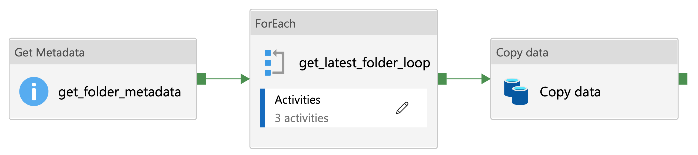
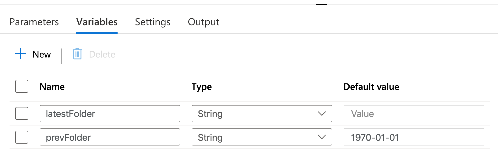
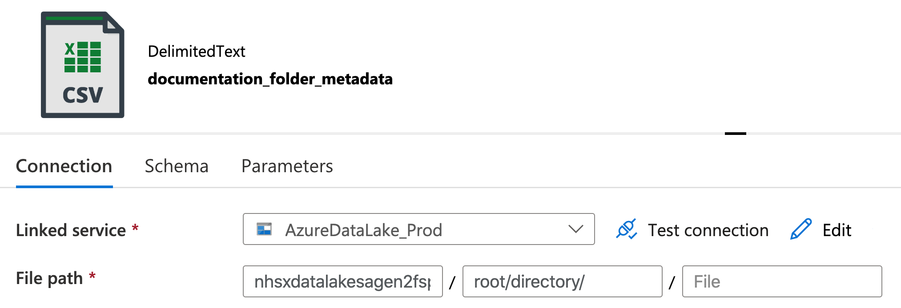
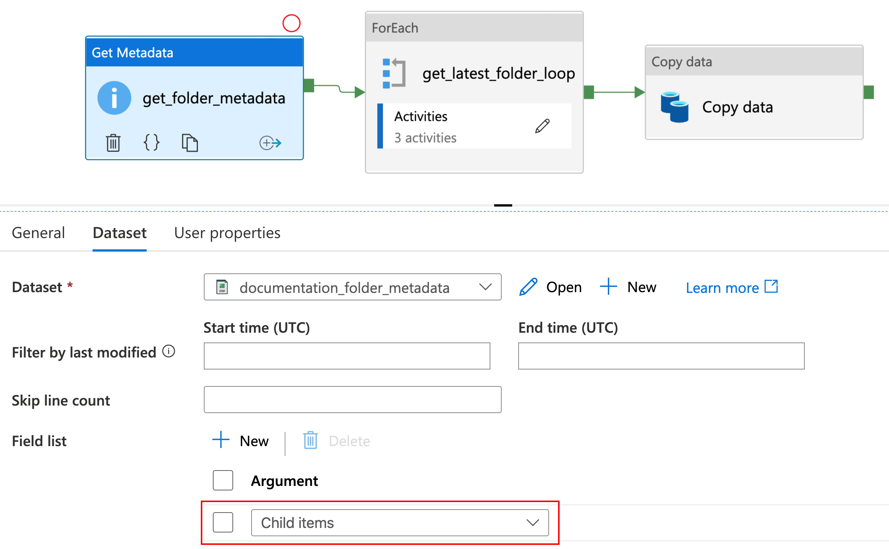
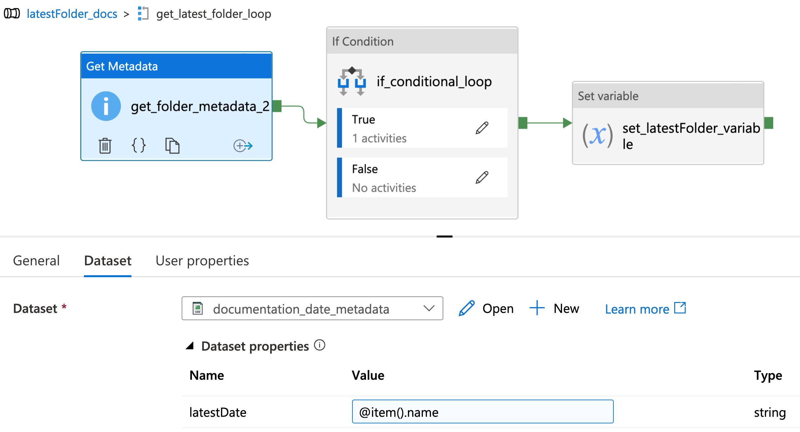
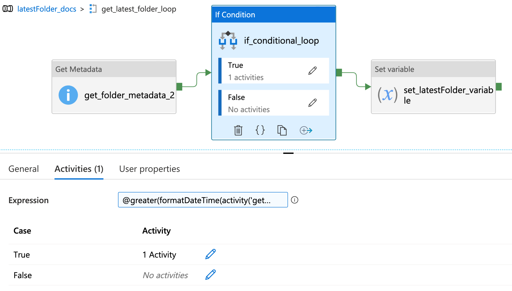
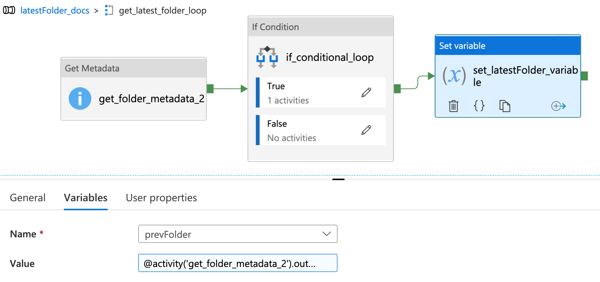
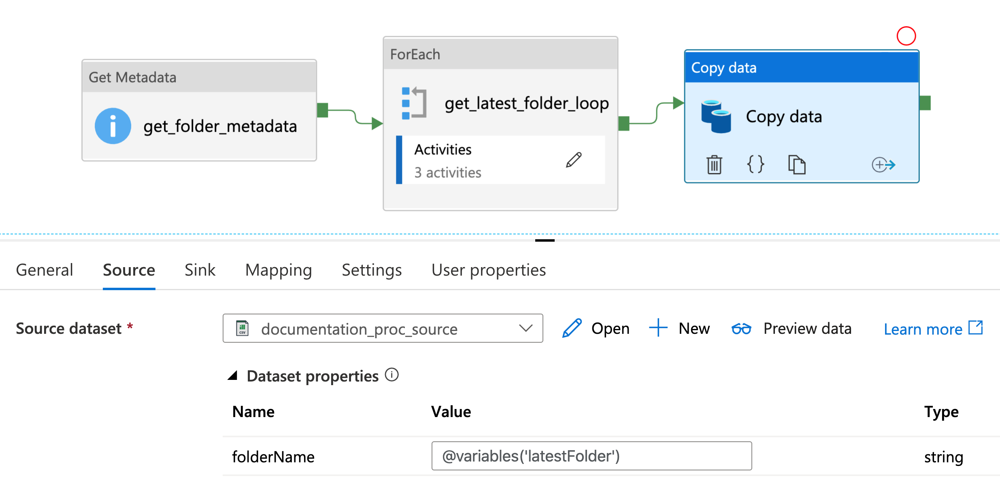

****************************
Azure Data Factory Utilities 
****************************

Open access and reusable design documentation of utilities used in the NHSX Analytics Unit Azure Data Factory (ADF) environment.

Latest Folder Lookup
====================

**Developed by:** Craig Shenton and Mattia Ficarelli 

The latest folder lookup ADF utility allows you to find the most recent folder from a directory of time-stamped folders. This utility was developed from a method to get the latest added file in a folder, the source of which can be found `here <https://stackoverflow.com/questions/60558731/get-the-latest-added-file-in-a-folder-azure-data-factory/60558836#60558836>`_. 

Problem
-------

Data is saved in directory of time stamped folders, as shown below.

.. code:: bash

    root/
    ├── directory/
    │   ├── 2021-06-01/
    │   ├── 2021-06-02/
    │   ├── 2021-06-03/
    │   └── 2021-06-04/

How to select the latest folder in an ADF pipeline based on the name of the folder (rather than the latest modified)?

Pipeline setup
--------------

Here we develop a template solution in Azure Data Factory that will compare the names of time-stamped folders to find the folder with the latest date.

*Figure 1: Overview of the latest folder lookup ADF utility*

**Step 1.** Create two pipeline variables: ``latestFolder`` and ``prevFolder`` (see Figure 2).
  
  * The ``latestFolder`` variable is an empty string to save the latest folder name.
  * The ``prevFolder`` variable is set to a historical date before you started collecting data for example, ‘1970-01-01’

*Figure 2: Adding pipeline variables*

**Step 2.** Create a 'folder_metadata' dataset with the path set to the root directory of the time-stamped folder for example, ``root/directory/`` (see Figure 3).

*Figure 3: Creating a folder_metadata dataset*

**Step 3.** Create a GetMetadata activity. More information on the GetMetadata ADF activity can be found `here <https://docs.microsoft.com/en-us/azure/data-factory/control-flow-get-metadata-activity>`_.
  
  * Link the 'folder_metadata' dataset to the GetMetadata activity under the dataset tab.
  * Add a 'Field List' argument as ``Child Items``, this will list each subfolder in the 'folder metadata' dataset (see Figure 4).

*Figure 4: Creating a GetMetadata activity*

Loop setup
----------

**Step 4.** Create a 'ForEach' activity. More information on the ForEach ADF activity can be found `here <https://docs.microsoft.com/en-us/azure/data-factory/control-flow-for-each-activity>`_.
  
  * In the ForEach activity settings, set 'items' as ``@activity('get_folder_metadata').output.childItems`` (see Figure 5).

.. image:: _static/img/latest_folder/foreach-activity.png
  :width: 600
  :alt: Creating a ForEach activity
*Figure 5: Creating a ForEach activity*

**Step 5.** Within the 'ForEach' activity create a second get GetMetadata activity (see Figure 6).
  
  * Create a 'date metadata' dataset with the path set to: ``@concat('root/directory/',dataset().latestDate)``
  * Set the target dataset to 'date_metadata' and add a parameter to the dataset called ``latestDate``
  * In the second GetMetadata activity set the parameter ``latestDate`` to ``@item().name``

*Figure 6: Creating a second GetMetadata activity, within the previously created ForEach activity*

Conditional setup
-----------------

**Step 6.** Create a 'If Conditional' activity. More information on the If Conditional ADF activity can be found `here <https://docs.microsoft.com/en-us/azure/data-factory/control-flow-if-condition-activity>`_.
  
**Step 7.** Set the expression in the If Conditional activity (added as dynamic content) as:

.. code-block:: bash

  @greater(formatDateTime(activity('get_folder_metadata_2').output.itemName,'yyyyMMdd'),formatDateTime(variables('prevFolder'),'yyyyMMdd'))

This will check if the name of each folder (formatted as a date) is greater (i.e., the latest) than the previous folder in the loop, starting with the default value - '1970-01-01' (see Figure 7).

*Figure 7: Setting an expression within an If Conditional activity*

**Step 8.** In the 'If Conditional' activity where ``Case = True`` (i.e.,  if the folder name is greater than the previous folder name) create a new Set Variable activity. More information on the Set Variable ADF activity can be found `here <https://docs.microsoft.com/en-us/azure/data-factory/control-flow-set-variable-activity>`_.
  
  * Within the Set Variable activity set ``Name = latestFolder`` and ``Value = @activity('get_folder_metadata_2').output.itemName`` (see Figure 8).

*Figure 8: Creating a Set Variable activity*

**Step 9.** Go back to the loop and add another Set Variable activity after the If Conditional activity.
  
  * Set ``Name = prevFolder`` and ``Value = @activity('get_folder_metadata_2').output.itemName.`` This will update the prevFolder value to the next folder in the set after each loop.

Output
------

**Step 10.** Create a 'latest_folder_source' dataset.

  * Set the path to ``@concat('root/directory/', dataset().folderName, '/')``.

**Step 11.** Add a parameter to ‘latest_folder_source’ dataset called folderName.

  * Set the parameter folderName to ``@variable('latestFolder')``.

**Step 12.** Create a 'Copy Data' activity. More information on the Copy Data ADF activity can be found `here <https://docs.microsoft.com/en-us/azure/data-factory/copy-activity-overview>`_.

  * Set the 'latest_folder_source' dataset as the source and an appropriate dataset as sink where you want to save the latest data (see Figure 9).

*Figure 9: Creation of a Copy Data activity with the 'latest_folder_source’ dataset set as the source*

JSON Configuration
------------------

Download the JSON configuration file below to use this template in your data pipelines.

:download:`latestFolder.json <config-files/adf-utilites/latestFolder.json>`

