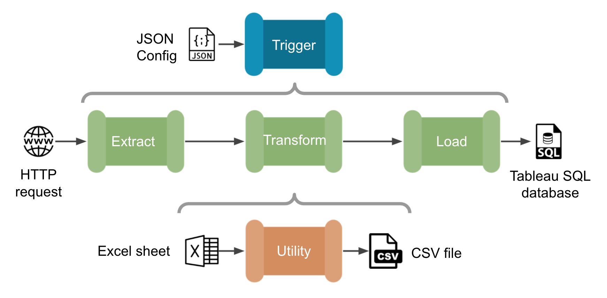
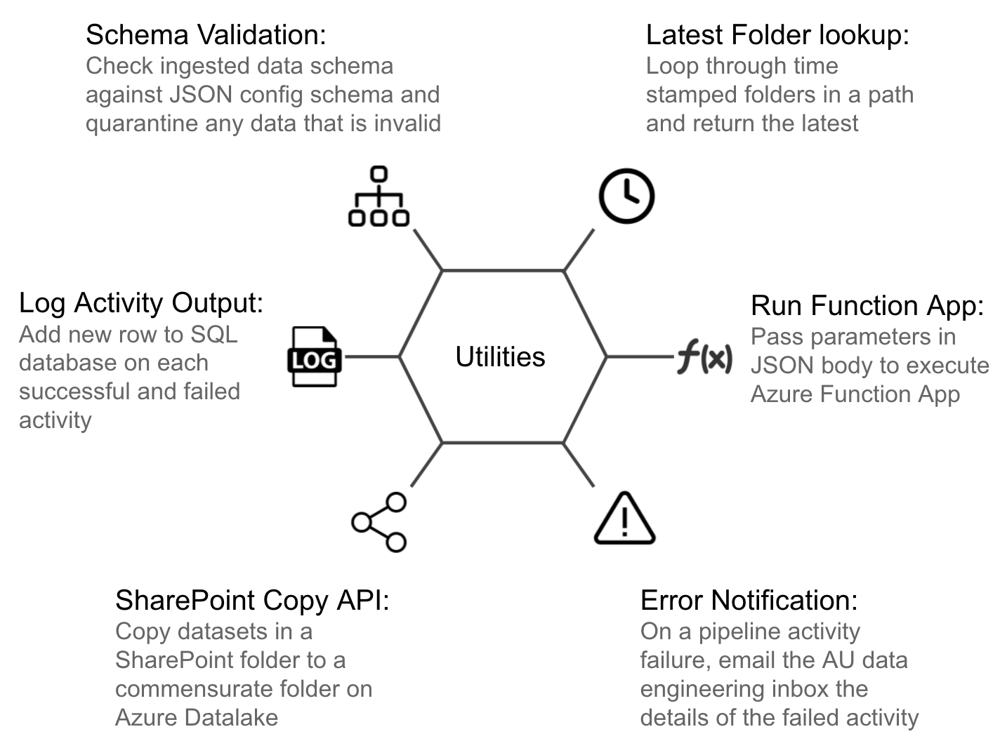
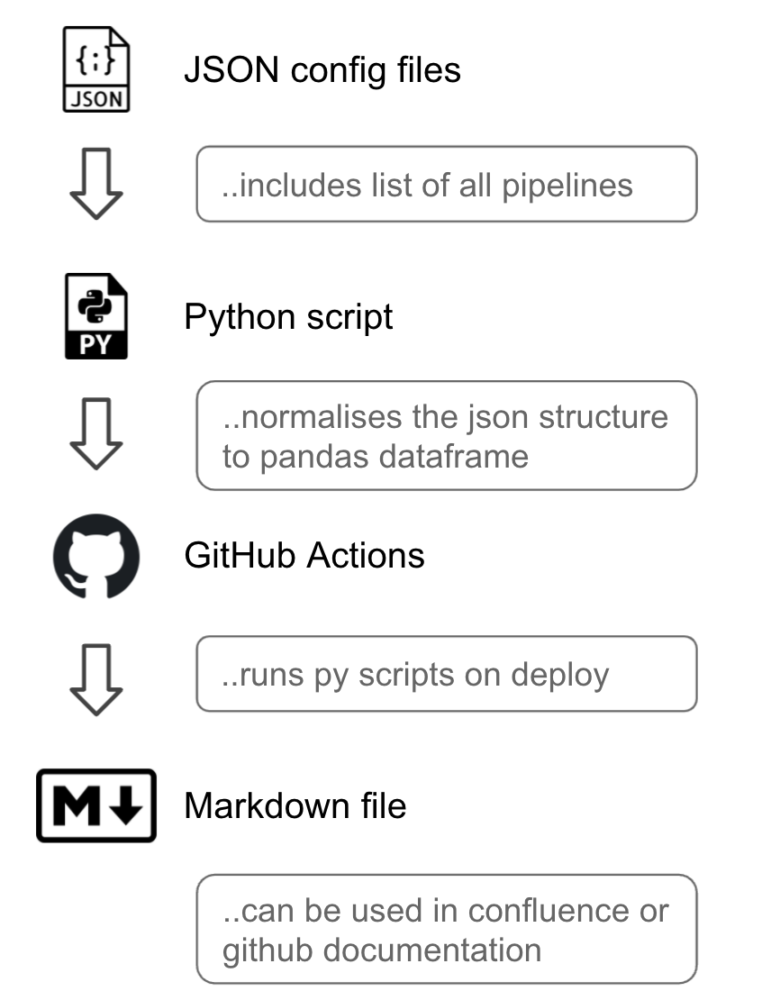

*****************
Azure Design Principles
*****************

Data Engineering Concepts
========

.. image:: _static/img/high-level.png
  :width: 600
  :alt: Azure Data Factory Concepts

  
Design Patterns
===============

#. Abstract and fully perameratised
#. Reusable code
#. Tested and robust
#. Maintainable
#. Efficient use of resources

Ingestion
---------

Standardised and parameterised ingestion templates for every scenario. Allow us to rapidly ingest new datasets with minimal configuration

.. image:: _static/img/ingestion.png
  :width: 600
  :alt: Azure Data Factory Ingestion Pipelines

Utilites
--------

Utilities can be reusable code or logic app APIs that allow us to standardise specific functions called across multiple pipelines. Most involve sending data back and forth to systems outside data factory and/or updating configuration files

Config as Code
==============

#. All pipelines are controlled from a JSON configuration file
#. Centralises the orchestration 
#. Avoids config mismatches between activities
#. Adds git version control

.. image:: _static/img/config-as-code.png
  :width: 600
  :alt: Config as Code

Docs as Code
------------

#. Principle that you should be writing documentation with the same tools as your code
#. Take it one step further - documentation is auto generated from the code
#. No way for documentation to be outdated or misaligned

