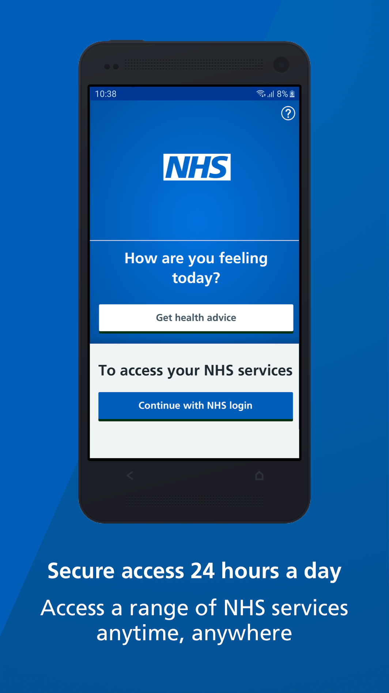

***************************
NHS App Analytics Dashboard
***************************

NHS App
========

https://www.nhs.uk/nhs-app/
https://www.nhs.uk/apps-library/nhs-app/
https://digital.nhs.uk/services/nhs-app

https://apps.apple.com/gb/app/nhs-app/id1388411277
https://play.google.com/store/apps/details?id=com.nhs.online.nhsonline&hl=en_GB&gl=US

NHS-App-Analytics-Dashboard
===========================

The NHS App dashboard enables you to see how many patients are using the NHS App across England, and which features they are using. It can be accessed by anyone with an NHS email address.

Information you can get through the dashboard
---------------------------------------------
You can choose to view figures at weekly or monthly data level.

You can view figures broken down by:

#. Regions
#. Sustainability and Transformation Partnerships (STP)
#. Clinical Commissioning Groups (CCG)
#. GP practice

You can view figures for the use of the individual features of the NHS App at any of these levels,  including:

#. Registrations – and registrations by patients who have not previously used patient online access
#. Appointment bookings and cancellations
#. Record reviews
#. Prescription requests
#. Visits to NHS 111 online
#. Organ donation registrations and withdrawals
#. Users visiting the health A-Z
#. Users visiting the national data opt-out site

The data is updated weekly, every Wednesday at 7:30am.

How to access the dashboard
---------------------------
To access the dashboard, you need to log in to your OKTA account. This is the same account used for other NHS Improvement services on the NHS Improvement website. Log in and then click on ‘My account’, select ‘Your analytical products’ and select ‘NHS App dashboard’.

Access the NHS App Dashboard: (https://tabanalytics.data.england.nhs.uk/#/views/NHSAppDashboard/Uptake)

Background to the NHS App dashboard
-----------------------------------
The NHS App dashboard is provided by NHSX, NHS Digital, and NHS England and Improvement. It enables those working in the health and care system to monitor the adoption and uptake of the NHS App. This information can then support strategic decision making at all levels of the system.

NHS App Data Dictionary
=======================

+---------------------------------------------------------+------------------------------------------------------------------------------------------------------------+
| Metric Name                                             | Description                                                                                                |
+=========================================================+============================================================================================================+
| NHS App Registrations                                   | Number of App users who have obtained P9 verification (full access) in the specified reporting period      |
+---------------------------------------------------------+------------------------------------------------------------------------------------------------------------+
| % of GP patients aged 13+ yrs, registered for NHS App   | Proportion of GP registered population registered for the NHS App to date (cumulative)                     |
+---------------------------------------------------------+------------------------------------------------------------------------------------------------------------+
| NHS App downloads                                       | Number of NHS App downloads from Google and Apple Stores in the specified reporting period                 |
+---------------------------------------------------------+------------------------------------------------------------------------------------------------------------+
| Total GP registered patients aged 13+ years             | Number of patients registered at a general practice to date (cumulative)                                   |
+---------------------------------------------------------+------------------------------------------------------------------------------------------------------------+
| GP population registered for Patient Online             | Number of 'online patients' registered for at least one online service to date (cumulative)                |
+---------------------------------------------------------+------------------------------------------------------------------------------------------------------------+
| Total GP List Size (from Patient Online)                | Number of patients registered at a general practice to date (cumulative)                                   |
+---------------------------------------------------------+------------------------------------------------------------------------------------------------------------+
| % GP population registered for Patient Online           | Proportion of GP registered population registered for GP Online Services to date (cumulative)              |
+---------------------------------------------------------+------------------------------------------------------------------------------------------------------------+
| NHS App Logins                                          | Number of NHS App logins in the specified reporting period                                                 |
+---------------------------------------------------------+------------------------------------------------------------------------------------------------------------+
| Users Booking Appointments                              | Number of App users booking GP appointments in the specified reporting period                              |
+---------------------------------------------------------+------------------------------------------------------------------------------------------------------------+
| Appointment Cancellation                                | Number of App users cancelling GP appointments in the specified reporting period                           |
+---------------------------------------------------------+------------------------------------------------------------------------------------------------------------+
| Users Requesting Prescriptions                          | Number of App users requesting prescriptions in the specified reporting period                             |
+---------------------------------------------------------+------------------------------------------------------------------------------------------------------------+
| User Accessing Medical Records                          | Number of App users accessing their medical records in the specified reporting period                      |
+---------------------------------------------------------+------------------------------------------------------------------------------------------------------------+
| Users Visiting NHS 111 Online                           | Number of App users visiting NHS 111 online from the NHS App in the specified reporting period             |
+---------------------------------------------------------+------------------------------------------------------------------------------------------------------------+
| Organ Donation Registrations                            | Number of App users who have registered to be an organ donor in the specified reporting period             |
+---------------------------------------------------------+------------------------------------------------------------------------------------------------------------+
| Organ Donation Updates                                  | Number of App users who have updated their Organ Donation Status in the specified reporting period         |
+---------------------------------------------------------+------------------------------------------------------------------------------------------------------------+
| Organ Donation Withdrawals                              | Number of App users who have withdrawn their organ donor registrations in the specified reporting period   |
+---------------------------------------------------------+------------------------------------------------------------------------------------------------------------+
| Users Visiting Health A-Z                               | Number of App users visiting the Health A-Z page in the specified reporting period                         |
+---------------------------------------------------------+------------------------------------------------------------------------------------------------------------+
| Users visiting National Data Opt-out                    | Number of App users visiting the National Data opt-out page in the specified reporting period              |
+---------------------------------------------------------+------------------------------------------------------------------------------------------------------------+

Change log
=======================

NHS App Dashboard v1.4
----------------------

Data Caveats
---------------
#. GP Registered Patients data is not available for a small proportion of GP practices. Any metrics that use this measure as a denominator (e.g. Proportion of GP population registered for the NHS App) will have a slightly higher than expected rate.

#. The dashboard displays data only for GP practices that are currently active. Should a practice close, their historical data will no longer appear in the dashboard.

## Version 1.4 Change Log (29-11-2020)

1. Features Added:
------------------

#. **National Summary and Local App Usage:** Split national and local level data into separate sheets. Filters now work correctly on all graphs with no caveats
#. **Data Table page:** Allows users to easily filter data via Region, STP, CCG, CCG Code, Practice, Practice Code. 
#. **Data Dictionary page:** Will help users understand the meaning, description, lowest level of data, calculation, limitations and data source(s) for the different metrics in the NHS App Analytics Dashboard
#. **Information icons:** Allow the user to understand the purpose behind each page 

2. User Interface Changes:
--------------------------

#. UI fixes on National Summary Dashboard charts and titles to ensure accessibility, as well as adherence to NHSE&I dashboard formatting guidance
#. Clickable mailto link added to About page to allow users to email developers for support
#. Minor UI fixes to the About page
#. UI fixes on National Summary and App Usage pages
#. Consistent colour scheme applied to all charts on dashboard to improve user experience
#. Minor UI fixes on National Summary and App Usage page
#. Header formatting changed for all pages to improve user experience
#. Null Value(s) option deleted from filters
#. Filters now correspond with all charts

3. Features Removed: 
-------------------

To ensure the dashboard only includes metrics that are supported by the NHS App, the following charts have been removed:
#. Registrations by Non-Patient Online users running total
#. % of registrations by Non-Patient Online Users based on running totals
#. Active returning visitors

Version 1.3 Change Log (29-09-2020)
-----------------------------------

1. User Verification Process:
-----------------------------

To improve the App’s user registration journey and increase digital uptake, a 2-tier verification process has been implemented for new App users. The two tiers are as follows: 
#. Partially Verified (P5) users - Requiring Name, Email, D.O.B, Postcode and Mobile Number 
#. Fully Verified (P9) users - Requiring Photo ID and Photo/Video Identity Matching 
Partially verified (P5) users cannot access confidential information, and have limited access to App features until fully (P9) verified. 

2. Updated Registration Metric:
-------------------------------

The 'NHS App Registrations' metric has been updated to give a count of new App users who have obtained full (P9) verification. The dashboard has now been updated to account for this change and will resume weekly updates.

As a result of the new verification process and developments to the App over time, a new method for tracking user acquisition has been established. Previously, patients moving practice may have been assigned a new Linkage Key, and would therefore have been counted as a new app user. Data prior to May-2020 has been updated to reflect the new tracking method made possible by the new verification system, which avoids the risk of duplication. This may result in a slightly lower registrations count at practice level prior to May-2020.
